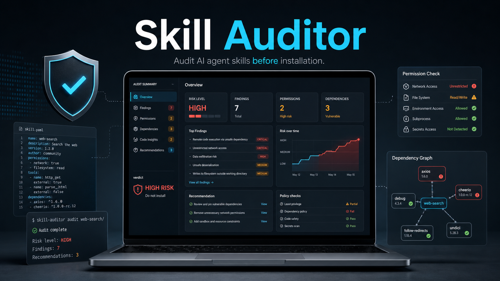

# Skill Auditor

[](SKILL.md)
[](scripts/audit_skill.py)
[](LICENSE)

[English](README.md) | [简体中文](README.zh-CN.md)



**在安装第三方 agent skill 之前，先做一次安全审计。**

`skill-auditor` 是一个 Codex/Claude 风格的 agent skill，同时内置一个本地静态扫描器，用来审阅 skills、plugins、安装脚本，以及 MCP 相关的工具包。它帮助 agent 在安装前回答一个真正重要的问题：

> 这个 skill 值得我在本机上运行吗？

## 为什么需要它

Agent skills 很强，因为它们不只是提示词，还可能包含脚本、依赖、本地文件访问、安装流程和工具权限。这也意味着它们天然有供应链风险。精美的 README、很多 stars、熟悉的作者，都不能单独证明一个 skill 安全。

`skill-auditor` 给 agent 一套可重复执行的审计流程：

- 检查 `SKILL.md` 指令
- 扫描脚本和 manifest 中的静态风险信号
- 审阅凭据、文件系统、网络和安装行为
- 输出带文件/行号证据的安装结论
- 在授予信任前建议沙箱运行或修复方案

## 快速开始

把这个仓库克隆到你的 agent skills 目录。

Codex 风格 skills：

```bash
git clone https://github.com/Danrry1996/skill-auditor.git ~/.codex/skills/skill-auditor
```

Claude Code 风格 skills：

```bash
git clone https://github.com/Danrry1996/skill-auditor.git ~/.claude/skills/skill-auditor
```

Windows PowerShell：

```powershell
git clone https://github.com/Danrry1996/skill-auditor.git "$env:USERPROFILE\.codex\skills\skill-auditor"
```

如果你的 agent 使用其他 skills 目录，把这个仓库克隆到对应目录即可。仓库根目录已经包含 `SKILL.md`。

然后对 agent 说：

```text
Use $skill-auditor to review this skill before I install it: <path-or-url>
```

## 直接运行扫描器

内置扫描器是零依赖 Python 脚本。它只读取文件，不会执行被审计仓库中的代码。

```bash
python scripts/audit_skill.py ./some-skill
python scripts/audit_skill.py ./some-skill --json > audit-report.json
```

输出示例：

```text
# Skill Audit Report

- Risk level: high
- Score: 55 / 100
- Findings: 3

### CRITICAL - Remote download is piped directly into an interpreter
- Rule: remote-shell-pipe
- Location: scripts/install.sh:12
- Recommendation: Download to a file first, inspect it, and execute only after explicit approval.
```

## 它会检查什么

| 范围 | 示例 |
| --- | --- |
| 远程执行 | 把网络下载内容直接传给 shell 或解释器执行 |
| 破坏性操作 | 递归强制删除、过宽的清理命令、不安全的路径处理 |
| 敏感信息 | API key、token 存储、私钥、完整环境变量导出 |
| 权限 | 全员可写文件、管理员/root 权限要求、过宽 ACL 变更 |
| 网络行为 | 对外 POST、遥测、文件上传、不清楚的目标域名 |
| 依赖 | 全局安装、未锁定依赖、移动分支、生命周期脚本 |
| Agent 指令 | 隐藏信任请求、绕过用户确认、模糊的数据处理说明 |

## 审计结论

`skill-auditor` 会引导 agent 给出四种结论之一：

| 结论 | 含义 |
| --- | --- |
| `install` | 没有明显静态风险，权限范围清楚且有限。 |
| `install with sandbox` | skill 有用，但会接触网络、包管理器或较宽的本地状态。 |
| `patch first` | 风险可修：锁定依赖、增加确认、脱敏日志、缩小路径范围。 |
| `reject` | 存在凭据外泄、隐藏远程执行、宽泛破坏性操作或绕过审批。 |

## 推荐提示词

```text
Use $skill-auditor to audit this repository before installation:
https://github.com/example/suspicious-skill

Give me a verdict, top risks, file/line evidence, and what I should change before installing.
```

## 仓库结构

```text
skill-auditor/
  SKILL.md                    # Agent 审计工作流
  scripts/audit_skill.py       # 静态扫描器
  references/risk-rules.md     # 风险等级和人工复核问题
  agents/openai.yaml           # Codex UI 元数据
  tests/                       # 扫描器测试
  assets/                      # README 视觉素材
```

## 设计原则

- **先读再运行。** 不要为了看看安装脚本做什么，就直接执行第三方安装器。
- **证据优先。** 严重风险必须能指向具体文件和行号。
- **先静态扫描，再人工复核。** 扫描器可以聚焦注意力，但不能证明绝对安全。
- **默认最小权限。** 网络、凭据、全局安装和宽泛文件访问都需要明确理由。
- **不确定就沙箱。** 有用但行为不清楚的 skill，先放进一次性环境里运行。

## 限制

这个项目不是恶意软件检测器，也不能证明一个仓库绝对安全。它用于发现常见静态风险模式，并给 agent 一套更稳的审计流程。即使扫描结果干净，仍然需要人工判断。

## 开发

运行测试：

```bash
python -m unittest discover -s tests
```

如果本机有 skill validator，可以校验 skill 元数据：

```bash
python path/to/quick_validate.py ./skill-auditor
```

扫描自身：

```bash
python scripts/audit_skill.py .
```

## 路线图

- GitHub Action：在 PR 中自动评论审计结果
- SARIF 输出：接入 code scanning
- 更强的 manifest 和 lifecycle script 解析
- 可信内部域名 allowlist 配置
- 更完整的 MCP/server 权限审阅

## 许可证

MIT
